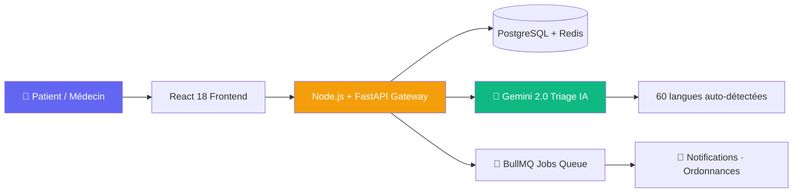
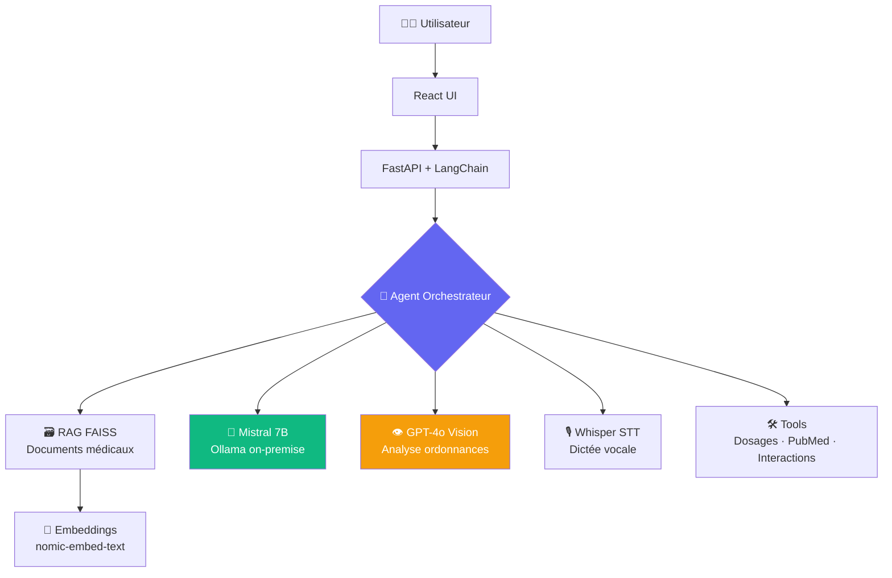
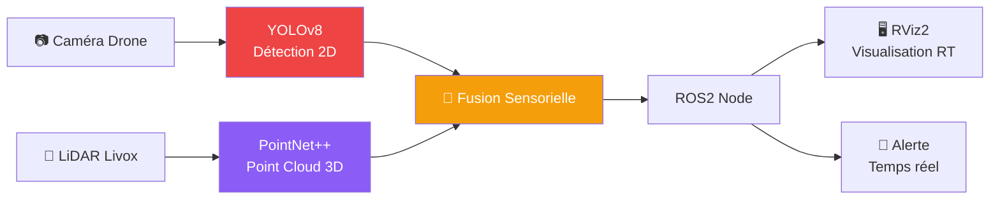

<p align="center">
  
</p>

<p align="center">
  
</p>

<p align="center">
  <a href="mailto:altaycevik@gmail.com"></a>
  <a href="https://linkedin.com/in/altay-cevik"></a>
  <a href="https://github.com/Altay55stage"></a>
  
  
</p>

---

## 🎯 Qui suis-je ?

> **Ingénieur R&D IA / Full-Stack / DevOps** — Master 2 IoT, UFR STGI Montbéliard  
> En stage chez **Faurecia Seating (FORVIA)** — Février → Juin 2025  
> J'architecture, je code, je livre : télémédecine, agents autonomes, computer vision 3D.

```
🏥  eHosp.fr          → Plateforme télémédecine (1000 users simultanés, API 100ms)
🤖  MedAssist AI      → Chatbot médical RAG FAISS + Mistral 7B + Agents
👁️  Computer Vision   → YOLOv8 drone edge 15FPS, PointNet++ LiDAR 95% accuracy
☁️  DevOps             → Docker · K8s · Terraform · CI/CD → -3000€/an infra
```

---

## 🔥 Stack Technique

<p align="center">

| 🖥️ Backend | 🎨 Frontend | ⚙️ DevOps / Cloud | 🧠 IA / ML |
|:-----------:|:-----------:|:-----------------:|:----------:|
|    |    |    |    |
|    |   |   |    |

</p>

---

## 🚀 Projets Phares

### 🏥 1. eHosp.fr — Plateforme Télémédecine Full-Stack

> **Lead Architect & Dev** — API REST · WebSocket · IA Triage · Redis · BullMQ



| Métrique | Résultat |
|----------|----------|
| 🔗 Connexions simultanées | **1 000+ validées en prod** |
| ⚡ Latence API (p95) | **< 100ms** |
| 🌐 Langues supportées | **60 (Gemini 2.0)** |
| 📡 WebSocket médical | **< 50ms latence** |
| 📊 Endpoints REST | **40 endpoints documentés** |
| 🔁 Cache Redis | **-60% latence base de données** |

---

### 🤖 2. MedAssist AI — Chatbot Médical RAG + Agents Autonomes

> **Mistral 7B on-premise · FAISS VectorDB · GPT-4o Vision · Whisper**



**Fonctionnalités clés :**
- 🔍 RAG vectoriel FAISS : recherche sémantique sur base médicale locale
- 💊 Agents autonomes : calcul dosages, vérification interactions médicamenteuses
- 📄 Vision IA : analyse et extraction automatique des ordonnances (GPT-4o)
- 🎙️ Whisper : dictée vocale multilingue pour professionnels de santé
- 🐳 Full Dockerisé, **100% on-premise**, données patients protégées

---

### 👁️ 3. Computer Vision 3D — Détection Humaine LiDAR

> **YOLOv8 · PointNet++ · ROS2 · LiDAR Livox · Drone Edge**



| Pipeline | Performance |
|----------|-------------|
| 🚁 YOLOv8 drone edge | **15 FPS · -40% latence** |
| 🎯 PointNet++ LiDAR | **95% accuracy · 50 epochs** |
| ⏱️ Inférence temps réel | **RViz2 · ROS2** |
| 📦 Dataset | **LiDAR Livox MID-360** |

---

## 📊 GitHub Stats

<p align="center">
  
  
</p>

<p align="center">
  
</p>

<p align="center">
  
</p>

---

## 📅 Timeline du Stage

```
🔷 Fév. 2025   → Prise de poste Faurecia Seating (FORVIA), Audincourt
                  Architecture eHosp.fr · Setup Docker/K8s · Spécifications

🔷 Mars 2025   → Développement API REST (40 endpoints, FastAPI + Node.js)
                  Pipeline Redis/BullMQ · WebSocket médical < 50ms

🔷 Avr. 2025   → Intégration IA : Gemini 2.0 triage, LangChain agents
                  RAG FAISS + Mistral 7B on-premise · GPT-4o Vision

🔷 Mai 2025    → Computer Vision : YOLOv8 drone 15FPS · PointNet++ 95%
                  ROS2 integration · Tests charge 1000 users

🔷 Juin 2025   → Terraform CI/CD (-3000€/an infra) · Rapport · Soutenance
                  Livraison prod · Documentation complète
```

---

## 🎓 Parcours Académique

| Année | Formation | Établissement |
|-------|-----------|---------------|
| 2024–2026 | **Master 2 IoT** *(en cours)* | UFR STGI — Montbéliard |
| 2022–2024 | **Licence 3 Informatique** | IUT / UFR STGI |
| 2022 | **BTS SN — Mention TB** | Lycée technique |

**Compétences transverses :** Architecture logicielle · Gestion de projet Agile · Documentation technique · R&D

---

## 🌍 Langues & Soft Skills

<p align="center">

| 🗣️ Langue | Niveau |
|:----------:|:------:|
| 🇫🇷 Français | Natif |
| 🇬🇧 Anglais | Professionnel (technique) |
| 🇹🇷 Turc | Bilingue |

</p>

**Soft skills :** Leadership technique · Autonomie · Communication scientifique · Force de proposition

---

## 🔮 Objectif : Alternance Septembre 2026

<p align="center">
  
  
  
</p>

**Domaines ciblés :**
- 🤖 R&D IA / LLM / Agents autonomes
- 🏗️ Backend avancé (Node.js, FastAPI, microservices)
- ☁️ DevOps / Cloud / MLOps
- 🔬 Computer Vision / Robotique (ROS2)

---

## 📬 Me contacter

<p align="center">
  <a href="mailto:altaycevik@gmail.com">
    
  </a>
  <a href="tel:+33783656837">
    
  </a>
  <a href="https://linkedin.com/in/altay-cevik">
    
  </a>
</p>

<p align="center">
  
</p>
