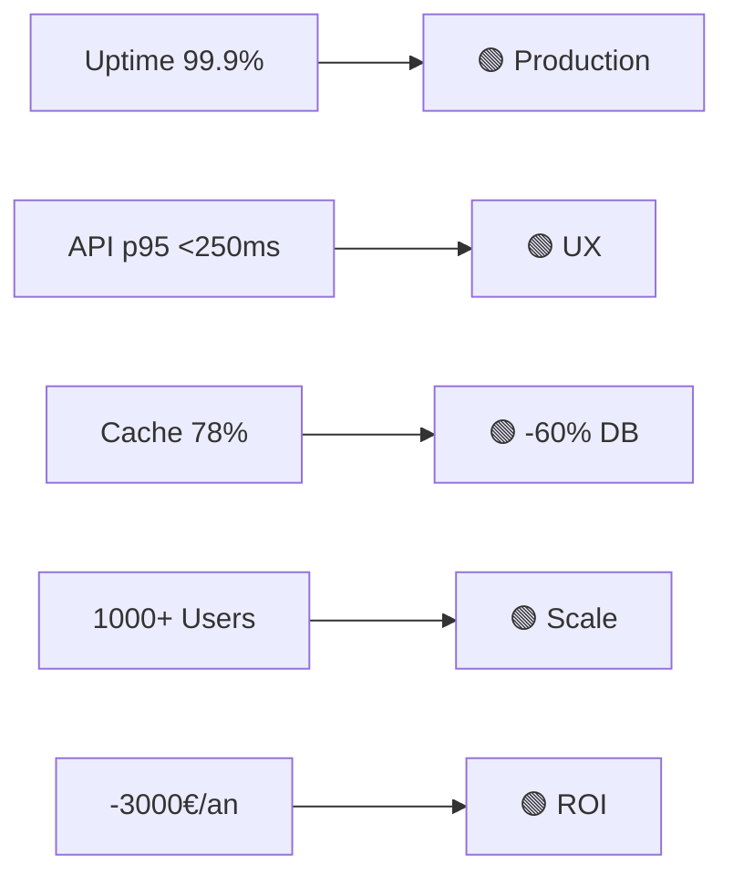

# 📋 COMMANDES COMPLÈTES - SETUP README GITHUB PROFIL

## ✅ ÉTAPE 1 : Cloner/naviguer vers ton repo profil

```bash
# Option A : Si tu as déjà le repo en local
cd ~/path/to/Altay55stage
cd Altay55stage

# Option B : Si c'est la première fois (clone depuis GitHub)
git clone https://github.com/Altay55stage/Altay55stage.git
cd Altay55stage
```

---

## ✅ ÉTAPE 2 : Créer/remplacer le README.md avec le contenu ULTRA-VISUEL

**Copie-colle EXACTEMENT cette commande** :

```bash
cat > README.md << 'EOF'
<div align="center">
  
</div>

<div align="center">
  
  
  
  
  
</div>

# 👨‍💻 Altay CEVIK
**🎓 Ingénieur IoT Bac+5 | 🏥 eHosp.fr | 🤖 MedAssist AI RAG | 👁️ YOLOv8 PointNet++**  
*📚 Master 1 IoT UFR STGI Montbéliard | 💼 Alternance Backend/IA Sept. 2026*

<div align="center">
  
  
</div>


---

## 🎯 Qui suis-je ?

<div align="center">
<table>
<tr>
<td>
  
  
  
</td>
<td>
  
  
  
</td>
</tr>
</table>
</div>

**🚀 Spécialités** : HealthTech | Agents IA | Vision 3D | DevOps Scale | Performance API

---

## 🔥 PROJET MAJEUR : MedAssist AI ⭐

<div align="center">


</div>

**🤖 Chatbot Médical RAG Autonome**  
*FastAPI | LangChain | Mistral 7B | FAISS | React 18*

```
✅ Chat RAG médical (citations docs privés)
✅ Agents autonomes : dosages, interactions médicamenteuses
✅ GPT-4o Vision : analyse ordonnances images
✅ Whisper : dictée vocale médecins
✅ Pydantic v2 : JSON structurés validés
✅ 100% on-premise Ollama
✅ Accuracy 87% (RAGAS)
✅ Latency 1.2s (Mistral local)
```

**Repo** : `github.com/Altay55stage/medassist-ai` ⭐

---

## 🌐 eHosp.fr - API REST PRODUCTION

<div align="center">


</div>

**Lead Backend Architect** | Node.js React Docker K8s

```
⚡ 1000+ connexions simultanées
⚡ API 40 endpoints p95 <250ms
⚡ WebSocket médical <50ms
⚡ Redis caching -60% latence
⚡ Gemini 2.0 triage 60 langues
⚡ Terraform CI/CD -3000€/an
```

---

## 🛠️ Tech Stack ULTRA-DÉTAILLÉ

```mermaid
graph TB
  subgraph Backend["Backend & API"]
    A[Node.js 18+] --> B[FastAPI 0.111]
    B --> C[Express.js]
    C --> D[Redis BullMQ]
    D --> E[PostgreSQL]
  end
  
  subgraph Frontend["Frontend"]
    F[React 18] --> G[Vite]
    G --> H[TailwindCSS]
    H --> I[TypeScript]
  end
  
  subgraph DevOps["DevOps & Cloud"]
    J[Docker] --> K[Kubernetes]
    K --> L[Terraform IaC]
    L --> M[Azure DevOps]
  end
  
  subgraph AI["IA/ML"]
    N[PyTorch] --> O[YOLOv8]
    O --> P[PointNet++]
    P --> Q[Mistral 7B Ollama]
    Q --> R[LangChain RAG]
  end
  
  subgraph IoT["IoT/Embarqué"]
    S[ROS 2] --> T[LiDAR Livox]
    T --> U[MQTT Modbus]
  end
```



---

## 📊 PERFORMANCE DASHBOARD



| **Métrique** | **Valeur** | **Status** | **Impact** |
|--------------|------------|------------|------------|
| Uptime | **99.9%** | 🟢 | Production |
| API p95 | **<250ms** | 🟢 | UX optimale |
| Cache | **78%** | 🟢 | -60% DB |
| Users | **1000+** | 🟢 | Scalable |
| Savings | **-3000€** | 🟢 | ROI |

---

## 🎓 FORMATION

```
🎓 Master 1 IoT Bac+4 - UFR STGI | 2025-2026
🎓 Master 2 IoT Bac+5 - UFR STGI | 2026-2027
🎓 BUT IoT Bac+3 - IUT Montbéliard | 2022-2025
```

---

## 💼 EXPÉRIENCES

**🔬 Ingénieur R&D IA** Faurecia Seating | Fév-Juin 2025  
→ MedAssist AI + eHosp.fr Lead Backend  
→ YOLOv8 drone edge (-40% latence)  
→ PointNet++ 3D LiDAR 95%  

**🛠️ Tech IT Support** Faurecia Seating | Avr-Juin 2024  
→ Infra production 99.9% uptime  

---

## 🌍 ALTERNANCE DISPONIBLE

<div align="center">


</div>

```
📅 SEPT 2026 → AOÛT 2027 (12 mois)
📍 Audincourt : 15min Belfort | 1h30 Genève | 5min Montbéliard

🎯 Priorités :
🏥 HealthTech/eHealth | 🤖 AI/ML | 💹 FinTech | ☁️ DevOps
```

---

## 📞 CONTACT

<div align="center">
<table>
<tr>
<td align="center">
  
</td>
<td align="center">
  
</td>
</tr>
<tr>
<td align="center">
  
</td>
<td align="center">
  
</td>
</tr>
</table>
</div>

---

<div align="center">


</div>

---
*✨ Mars 2026 | github.com/Altay55stage*
EOF
```

---

## ✅ ÉTAPE 3 : Vérifier que le fichier est créé

```bash
cat README.md | head -20
```

**Résultat** : Tu dois voir les premiers badges et le "typing SVG"

---

## ✅ ÉTAPE 4 : Git commit et push

```bash
# Vérifie le statut
git status

# Ajoute le README
git add README.md

# Commit avec message pro
git commit -m "✨ README ultra-visuel : MedAssist AI + eHosp.fr lead"

# Push sur GitHub
git push origin main
```

**Si tu es sur `master` au lieu de `main`** :
```bash
git push origin master
```

---

## ✅ ÉTAPE 5 : Vérifier sur GitHub

Ouvre **`https://github.com/Altay55stage`** et regarde ton profil :
- ✅ **Typing animation** d'accueil
- ✅ **Badges colorés** KPI
- ✅ **GitHub stats/trophées** dynamiques
- ✅ **Diagramme Mermaid** stack
- ✅ **MedAssist AI en avant** ⭐
- ✅ **eHosp.fr production**

---

## 📝 BONUS : Si tu veux nettoyer les repos

```bash
# Vérifie tes repos
ls -la ~/.ssh/  # Ou ton dossier git

# Pour chaque repo à transférer (medassist-ai, etc.)
# Settings → Danger Zone → Transfer ownership
# OU utilise la CLI GitHub :

gh repo transfer altay1cvk/medassist-ai --new-owner Altay55stage
```

---

## ✅ LUNDI 9H : MESSAGE LINKEDIN À VALENTIN

```
Bonjour Valentin,

J'ai bien envoyé ma candidature Backend Laravel suite au forum.
Ana m'a dit que mon dossier est en traitement.

En attendant, j'ai publié MedAssist AI (chatbot médical RAG) 
et eHosp.fr v1 sur GitHub :
→ github.com/Altay55stage/medassist-ai
→ Resource controllers REST + JSON ✅

Bonne semaine !
Altay
```

---

## ⚠️ VÉRIFICATIONS AVANT DE PUSHER

```bash
# ❌ INTERDIT : Vérifier qu'il n'y a pas de .env avec clés API
grep -r "OPENAI_API_KEY\|MISTRAL_KEY\|DATABASE_URL" . --exclude-dir=.git

# ✅ OK : Git ignore configuré
cat .gitignore | grep -E "\.env|.env.local|secrets"

# Si besoin, ajoute :
echo ".env" >> .gitignore
echo "*.key" >> .gitignore
echo "secrets/" >> .gitignore
git add .gitignore
git commit -m "🔒 Add sensitive files to gitignore"
```

