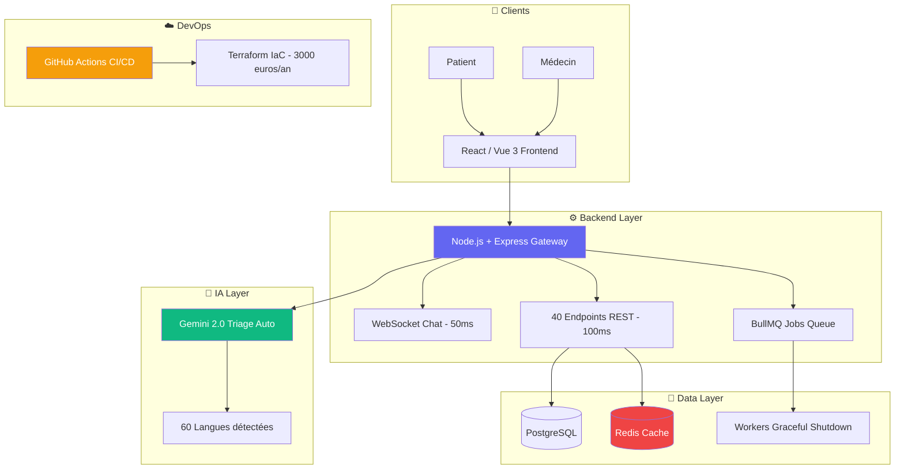
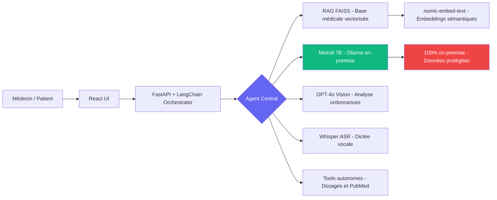
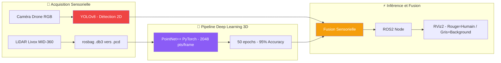

<p align="center">
  
</p>

<p align="center">
  
</p>

<p align="center">
  <a href="mailto:altaycevik@gmail.com">
    
  </a>
  <a href="https://linkedin.com/in/altay-cevik">
    
  </a>
  <a href="https://github.com/Altay55stage">
    
  </a>
  <a href="https://zenodo.org/records/18765299">
    
  </a>
  
</p>

<p align="center">
  
  
  
  
</p>

---

## 🧠 Qui suis-je ?

> **Ingénieur Full-Stack · DevOps · IA / Computer Vision**  
> Master 1 IoT — Université de Franche-Comté (UFC), UFR STGI Montbéliard  
> Ancien stagiaire **FEMTO-ST (CNRS UMR 6174)** · Ex Faurecia Seating (FORVIA)

Je conçois des architectures complètes : de l'API haute performance au pipeline Computer Vision embarqué, du RAG médical à l'inférence LiDAR temps réel. **Tout ce que je touche, je le ship en prod.**

En parallèle, je conduis une **recherche fondamentale sur l'informatique post-silicium** : l'*ALTAY Architecture*, publiée sur [Zenodo](https://zenodo.org/records/18765299), explore la computation organo-quantique comme successeur thermodynamique inévitable de von Neumann.

```
🏥  eHosp.fr           → Plateforme télémédecine · 1000 users · API <100ms (Lead Architect)
🤖  MedAssist AI       → RAG FAISS + Mistral 7B + Agents autonomes + Vision ordonnances
👁️  DORAM R&D          → YOLOv8 15FPS drone · PointNet++ 95% accuracy · LiDAR Livox ROS2
🧬  ALTAY Architecture → Manifeste post-silicium · ADN · CRISPR-CPU · Organoids · Mycelium
```

---

## ⚡ Stack Technique Complète

<p align="center">

| 🖥️ Backend & API | 🎨 Frontend | ⚙️ DevOps / Cloud | 🧠 IA / ML / Vision |
|:-:|:-:|:-:|:-:|
|    |    |    |    |
|    |   |    |    |
|     |  |  |   |
|  | | |    |

</p>

---

## 🚀 Projets Phares

---

### 🏥 eHosp.fr — Plateforme Télémédecine Full-Stack
> **Lead Architect & Developer · Autonomie totale · Stack apprise et maîtrisée en 6 mois**



<details>
<summary><b>🔍 Preuve technique — Graceful Shutdown BullMQ (code réel extrait du repo)</b></summary>

```typescript
async shutdown() {
  logger.info('🛑 Arrêt du service de file d\'attente...');
  try {
    const workerPromises = Object.values(this.workers)
      .map(worker => worker.close());
    await Promise.all(workerPromises);
    const queuePromises = Object.values(this.queues)
      .map(queue => queue.close());
    await Promise.all(queuePromises);
    logger.info('✅ Service de file d\'attente arrêté proprement');
  } catch (error) {
    logger.error('❌ Erreur arrêt service:', { error: error.message });
  }
}
// Écoute des signaux système UNIX — zéro perte de job au redéploiement
process.on('SIGTERM', async () => { await queueService.shutdown(); process.exit(0); });
process.on('SIGINT',  async () => { await queueService.shutdown(); process.exit(0); });
```
</details>

| 📊 Métrique | ✅ Résultat |
|:-----------|:----------:|
| Connexions simultanées validées en prod | **1 000+** |
| Latence API moyenne | **< 100ms** |
| API p95 | **< 250ms** |
| Réduction latence via Redis caching | **− 60%** |
| Latence WebSocket médical temps réel | **< 50ms** |
| Endpoints REST documentés | **40** |
| Langues Gemini 2.0 | **60** |
| Économie infrastructure / an vs SaaS | **− 3 000 €** |
| Capacité queue testée | **10 000+ req/min** |

---

### 🤖 MedAssist AI — Chatbot Médical RAG + Agents Autonomes
> **Mistral 7B on-premise · FAISS · GPT-4o Vision · Whisper · 100% Dockerisé**



**Ce que fait l'agent :**
- 🔍 Recherche sémantique dans la base documentaire médicale (FAISS + embeddings)
- 💊 Calcul automatique des dosages & vérification des interactions médicamenteuses
- 📄 Extraction et structuration des ordonnances par Vision IA (GPT-4o)
- 🎙️ Dictée vocale Whisper pour les professionnels (multilangue)
- 🔒 Déployé **100% on-premise** — zéro donnée patient dans le cloud

---

### 👁️ Projet R&D DORAM — 3D Deep Learning @ FEMTO-ST CNRS
> **PointNet++ · YOLOv8 · LiDAR Livox MID-360 · ROS2 · PyTorch**



<details>
<summary><b>🔍 Preuves techniques — CLI réelles du rapport de recherche</b></summary>

```bash
# Fine-tuning YOLOv8 (commande exacte issue du rapport de stage)
yolo train \
  data=path/to/your_dataset.yaml \
  model=yolov8n.pt \
  epochs=100 \
  imgsz=640 \
  batch=8 \
  device=0 \
  name=my_drone_finetune
```

```python
# Analyse des splits du dataset LiDAR (script exact du projet)
python3 -c "import glob, json; \
  [print(split, sum(len(json.load(open(f))['objects']) \
  for f in glob.glob(f'{split}/*.json'))) \
  for split in ['train','test','val']]"
```
</details>

| Pipeline | Résultat |
|:---------|:--------:|
| 🚁 YOLOv8 drone edge | **15 FPS · − 40% latence système** |
| 🎯 PointNet++ (50 epochs) | **95% Accuracy** |
| 📡 Capteur LiDAR | **Livox MID-360** |
| 🔁 Framework robotique | **ROS2 + RViz2** |
| 🛠️ Outil annotation interne | **YOLO Annotator Pro (Vue 3)** |
| 🏛️ Tuteur académique | **Dr. François SPIES — FEMTO-ST CNRS UMR 6174** |

---

### 🧬 ALTAY Architecture — Informatique Post-Silicium
> **Publication scientifique · [Zenodo DOI](https://zenodo.org/records/18765299) · Fév 2026 · 3h du matin · Montbéliard**

[](https://zenodo.org/records/18765299)

> *"La biologie est le seul système computationnel qui s'améliore par lui-même, qui se répare sans intervention, et qui évolue sans être reprogrammé. Tout le reste n'est qu'émulation grossière."*
> — **Altay CEVIK**, ALTAY Architecture v2.0 OMEGA BUILD

**Le problème :** Les data centers consommeront ~1 000 TWh/an d'ici 2026. Entraîner GPT-4 = 50 GWh = consommation annuelle de 4 500 foyers. La miniaturisation CMOS a atteint **sa limite physique absolue** (effet tunnel à 2 nm). La solution n'est pas l'optimisation du silicium. **C'est son remplacement.**

**Un stack de 9 couches technologiques biologiques :**

```
┌─────────────────────────────────────────────────────────────┐
│  COUCHE 9 · GOUVERNANCE CONSCIENTE                          │
│  Humain + BCI → Collapse de la fonction d'onde décisionnelle│
├─────────────────────────────────────────────────────────────┤
│  COUCHE 8 · INTERFACE NEURO-TEMPORELLE                      │
│  tACS → Hippocampe → LTP → Mémoire de travail amplifiée     │
├─────────────────────────────────────────────────────────────┤
│  COUCHE 7 · ORCHESTRATION BIOÉLECTRIQUE                     │
│  Champs de Levin (Tufts) → Morphogenèse computationnelle    │
├─────────────────────────────────────────────────────────────┤
│  COUCHE 6 · QUANTUM ENGINE VIBRONIQUE                       │
│  Complexes FMO → QML à 310K (sans cryogénie) → 2^N états   │
├─────────────────────────────────────────────────────────────┤
│  COUCHE 5 · CALCUL PHOTONIQUE BIOLOGIQUE                    │
│  Collagène + Optogénétique → THz switching · 0 résistance   │
├─────────────────────────────────────────────────────────────┤
│  COUCHE 4 · PROCESSEUR ORGANOID (FinalSpark)                │
│  16 organoïdes × 10 000 neurones → ×10⁶ efficacité énergie  │
├─────────────────────────────────────────────────────────────┤
│  COUCHE 3 · RÉSEAU MYCÉLIEN NEUROMORPHIQUE                  │
│  Memristors fongiques Shiitake (5.85 kHz) · Auto-croissant  │
├─────────────────────────────────────────────────────────────┤
│  COUCHE 2 · CRISPR-CPU CELLULAIRE                           │
│  dCas9 + sgRNA → Portes logiques AND/OR/NOT dans cellule    │
├─────────────────────────────────────────────────────────────┤
│  COUCHE 1 · MÉMOIRE ADN SYNTHÉTIQUE                         │
│  215 Po/g · 700 000 ans de rétention · Correction d'erreurs │
└─────────────────────────────────────────────────────────────┘
    RÉDUCTION ÉNERGÉTIQUE : 1 000 TWh/an → 1 TWh/an
    GAIN : − 6 ORDRES DE GRANDEUR
```

📄 **[Lire le manifeste complet sur Zenodo →](https://zenodo.org/records/18765299)**

---

## 📊 GitHub Stats

<p align="center">
  
  
</p>

<p align="center">
  
</p>

<p align="center">
  
</p>

---

## 💼 Expériences Professionnelles

### 🔬 Ingénieur R&D Stagiaire — Computer Vision & IoT
**FEMTO-ST (CNRS UMR 6174), Montbéliard** · *24 Fév → 13 Juin 2025 (5 mois)*

- Pipeline **YOLOv8 temps réel** (15 FPS) sur systèmes embarqués drone — **−40% latence**
- Développement autonome de **"YOLO Annotator Pro"** (Vue 3 / Tailwind) : annotation d'images RGB, gestion datasets, monitoring des entraînements IA
- Acquisition **MQTT / Modbus** sur capteurs industriels
- Deep Learning 3D : **PointNet++ sur LiDAR Livox** (ROS2), accuracy **95%**, 50 epochs
- Tuteur académique : **Dr. François SPIES** — CNRS | `francois.spies@univ-fcomte.fr`

### 🏭 Technicien IT Support Industriel Stagiaire
**Faurecia Seating (FORVIA), Audincourt** · *Avr → Juin 2024 (3 mois)*

- Maintenance préventive et curative des infrastructures réseaux et matérielles critiques
- Production à flux tendu **Just-In-Time** — haute pression industrielle
- Uptime maintenu **> 99,9%** — zéro blocage de ligne de production

---

## 🎓 Parcours Académique

| 📅 Période | 🎓 Diplôme | 🏛️ Établissement |
|:----------:|:----------:|:----------------:|
| 2026 → 2027 | **Master 2 IoT** | UFC Montbéliard |
| **2025 → 2026** | **Master 1 IoT** *(en cours)* | **UFR STGI — UFC Montbéliard** |
| 2022 → 2025 | **BUT IoT** | IUT Montbéliard |

---

## 📅 Timeline Complète

```
🔷 2022–2025   BUT IoT IUT Montbéliard
               └─ C/C++, Python, ROS2, MQTT, Modbus, systèmes embarqués

🔷 Avr–Juin 2024   Stage IT Faurecia Seating (FORVIA) — Audincourt
                   └─ Infra réseau prod · Just-In-Time · 99.9% uptime garanti

🔷 Fév–Juin 2025   Stage R&D Ingénieur — FEMTO-ST CNRS UMR 6174
                   ├─ YOLOv8 drone 15FPS · −40% latence système
                   ├─ PointNet++ LiDAR Livox · 95% accuracy · ROS2
                   └─ YOLO Annotator Pro (Vue 3 / Tailwind)

🔷 2025–2026   Master 1 IoT UFC Montbéliard
               ├─ Architecture eHosp.fr (Lead, 1000 users, API <100ms)
               ├─ MedAssist AI (RAG FAISS + Mistral 7B + Agents)
               └─ R&D DORAM (PointNet++ 3D Deep Learning)

🔷 25 Fév 2026   Publication "ALTAY Architecture" — Zenodo
                 └─ Manifeste post-silicium · Informatique biologique · 9 couches

🔷 Sept 2026   Recherche Alternance (12 mois) — Backend · IA · DevOps · R&D
```

---

## 🌍 Langues

| 🗣️ Langue | Niveau |
|:---------:|:------:|
| 🇫🇷 Français | Maternel |
| 🇬🇧 Anglais | Professionnel |

---

## 🔮 Objectif — Alternance Septembre 2026

<p align="center">
  
  
  
</p>

**Domaines ciblés :**
```
🤖  R&D IA / LLM / Agents autonomes
🏗️  Backend avancé — Node.js · FastAPI · microservices · architecture distribuée
☁️  DevOps / Cloud / MLOps — K8s · Terraform · CI/CD
🔬  Computer Vision / Robotique — ROS2 · capteurs embarqués
🧬  (Bonus) Deep Tech / Bio-Computing — post-silicium · neuromorphique
```

**Zone géographique :** Audincourt · Belfort · Besançon · Bâle (30 min) · Genève (1h30) · 

---

## 📬 Me Contacter

<p align="center">
  <a href="mailto:altaycevik@gmail.com">
    
  </a>
  <a href="tel:+33783656837">
    
  </a>
  <a href="https://linkedin.com/in/altay-cevik">
    
  </a>
  <a href="https://zenodo.org/records/18765299">
    
  </a>
</p>

<p align="center">
  
</p>
